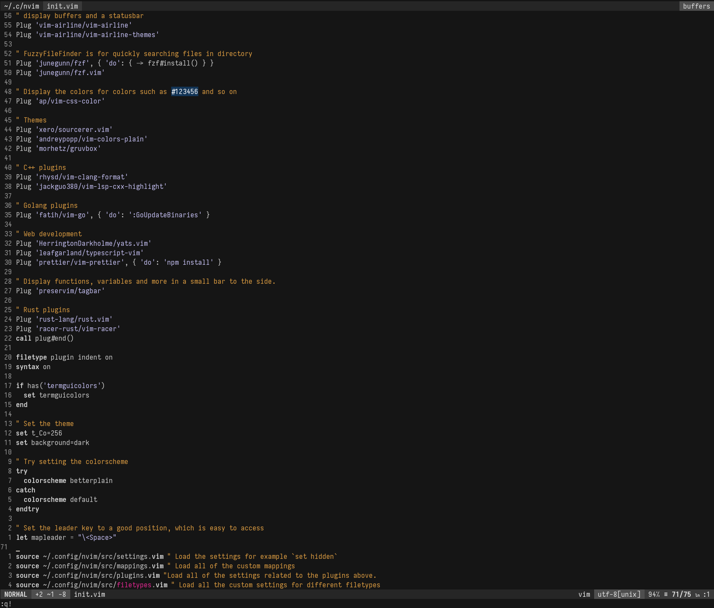

# Vim configuration

This repository includes all the configuration files that use with Vim. I'am currently using Vim as my main text editor so there might be lots of changes to the configuration.

## Installation

```
git clone https://github.com/nireo/nvim ~/.config/nvim
```

You need to install different language providers for nvim:

```
npm install -g coc.nvim neovim
pip install neovim
```

You can install additional coc.nvim extensions to have auto completion for many different languages, for example:

```
" src/plugins.vim
let g:coc_global_extensions = [
  \ 'coc-snippets',
  \ 'coc-pairs',
  \ 'coc-tsserver',
  \ 'coc-eslint',
  \ 'coc-prettier',
  \ 'coc-json',
  \ 'coc-go',
  \ 'coc-html',
  \ 'coc-clangd',
  \ 'coc-rls'
  \ ]
```

Those are just examples of the coc extensions. A full list of implemented coc extensions can be found [here](https://github.com/neoclide/coc.nvim/wiki/Using-coc-extensions#implemented-coc-extensions).

## betterplain color scheme

A simple color scheme based on [plain](https://github.com/andreypopp/vim-colors-plain) mainly with small changes.

## Screenshot


